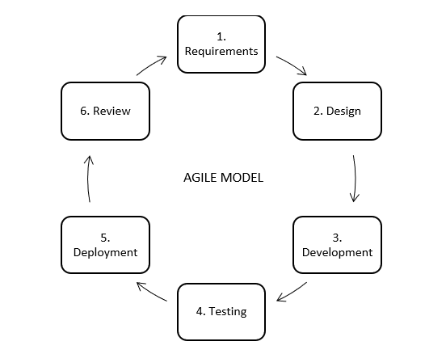

# What is an SDLC model?
SDLC models are the framework or methods that define how software is planned, designed, developed, tested, deployed and maintained.
Different SDLC models are used based on:
-	Project size and complexity
-	Requirement stability
-	Risk level
-	Customer involvement
-	Time and budget constraints

## Common SDLC models
**1.	Waterfall Model:**
The Waterfall model is a linear and sequential model where each phase must be completed before moving to the next and we cannot go back to the previous phase. The phases cannot be overlapped in this model. The output of one phase serves as an input for another phase.

### Advantages:
-	Simple and easy to understand
-	Easy to manage due to clear phases
### Disadvantages:
-	No flexibility for requirement changes
-	Late testing increases risk 
-	Defects found late are expensive to fix
-	Not suitable for complex projects
### Best For:
-	Suitable for small projects with fixed requirements
-	Projects that need strict budget and timeline control

**2.	V-Model (Verification and Validation Model):**
This model is widely used in Software Development Process and it is considered as a disciplined model. In this model, testing activities are planned in parallel with development phases. The left side of the model is for verification (development phases) and the right side is for validation (testing phases) and both of them are connected to each other in V-shape through Coding phase, hence it is called V-Model.

### Advantages:
-	Early test planning
-	Defects are detected early and reduces the cost of error handling
-	Clear relationship between development and test phases
### Disadvantages:
-	Rigid like Waterfall model
-	Not suitable when requirements change frequently
-	Increases development costs and time because of extensive QA
-	Requires extra effort for documentation
### Best For:
-	Safety-critical systems where validation is crucial and failures is unacceptable (e.g. aviation, medical software development)

**3.	Incremental Model:**
In the Incremental model, the system is developed in small and fully functional increments or modules, where each increment adds new functionality. Each module is developed, tested and delivered separately. Modules can be built sequentially or in parallel and each module goes through all SDLC phases. After the module is developed, the user feedback is taken and it is developed through several versions until an accepted system is developed.

### Advantages:
-	Early delivery of working software
-	Easier defect identification and early visibility of working results
-	Allows changes and adaptions to modules that are not yet in development
-	Customer feedback after each increment
### Disadvantages:
-	Requires good planning
-	Integration can be complex
### Best For:
-	Software with logically separated components (e.g. user module, payment, reporting).
-	Software that needs to be delivered fast on the market along with maintaining stability.

**4.	Iterative Model:**
In this model, software development is started with some requirements. After software is developed, it will be reviewed.  If it needs some changes then a new version of the software will be developed on the basis of required changes. This process of development, reviewing and developing with new changes will repeat many times until we get the final product. 

### Advantages:
-	Provides flexibility to support changing and evolving requirements
-	Early risk identification through repeated cycles
-	User feedback from early stage improves later stages
### Disadvantages:
-	Needs client involvement throughout the project
-	May consume more time if iterations are poorly planned
-	Scope creep is possible if requirements are not controlled 
### Best For:
-	Projects with evolving requirements.

**5.	Spiral Model:**
This model consists the characteristics of both iterative and waterfall models. In Spiral model, the software development process is described in four phases (planning, risk analysis, prototype development and evaluation of the current solution state) that are repeated until the project is completed. After each iteration a more and more complete version of software is developed. It puts a strong emphasis on risk assessment. This model assumes extensive client involvement during the planning, prototyping, and evaluation phases of each cycle.

### Advantages:
-	Best for large, high-risk projects since it provides strong risk management through early risk analysis
-	Gives reliable and high-quality software through repeated iterations with refinement
-	Allows flexibility to apply new changes in new cycles
### Disadvantages:
-	Expensive
-	Complex to manage and requires heavy client involvement
### Best For:
-	Large and complex projects with significantly high risk (e.g. online banking, telecom control,etc)

**6.	Agile Model:**
Agile model is the combination of iterative and incremental model. This model mainly focuses on customer satisfaction, adaptability and delivery of functional part of the application quickly. In earlier times, waterfall model was used extensively. However, this model created several problems in real-world projects. The biggest issue was that customers often requested changes during the development process, and incorporating these changes required a large amount of time and cost. To overcome these limitations, the Agile model was proposed in the 1990s.
In the agile model, the software product is divided into small increments (smallest part will be developed first and then the larger one). Each increment is developed through an iteration. 
Iterations are kept small and manageable, usually lasting two to three weeks. At any given time, only one iteration is planned, developed, tested, and deployed, ensuring better focus and control.

### Advantages:
-	Adapts to change easily
-	Promotes accountability and ownership resulting in faster delivery and high-quality of product 
-	High customer satisfaction
-	Ensures transparent progress
### Disadvantages:
-	Time consuming if no strict focus or discipline is followed
-	Requires active customer involvement
### Best For:
-	Large-scale, complex projects and high-risk projects that need both iterative planning and strong governance.
-	Projects with frequently changing requirements and fast time-to-market

## Comparison of SDLC Models

| Model | Flexibility | Risk Handling | Testing Time |
|------|------------|---------------|--------------|
| Waterfall | Low | Low | Late |
| V-Model | Low | Medium | Early |
| Incremental | Medium | Medium | Frequent |
| Iterative | High | Medium | Repeated |
| Spiral | High | High | Risk-based |
| Agile | Very High | Medium-High | Continuous |
