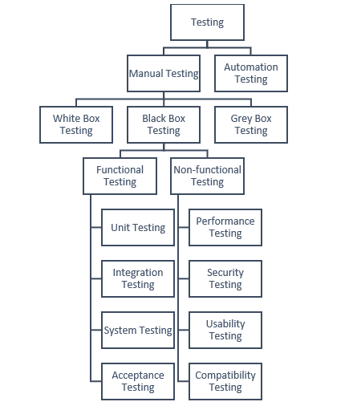

# 🧪 Software Testing Types
This document summarizes fundamental software testing concepts, techniques, and strategies commonly used in real-world Quality Assurance (QA) processes.

## 📑 Table of Contents
- Manual Testing
- Manual Testing Techniques
- Functional Testing
- Non-Functional Testing
- Automation Testing
- Manual vs Automation Testing
- Testing Strategies
- Summary

## 👨‍💻 Manual Testing

Manual testing is the process of validating software functionality by executing test cases manually without automation tools, simulating real user behavior to ensure the application works as expected.
### Advantages
- No programming knowledge required
- Detects usability and user-experience issues
- Flexible for exploratory testing

### Disadvantages
- Time-consuming
- Prone to human error
- Inefficient for repetitive testing
## 🔍 Manual Testing Techniques

### White Box Testing

Tests internal code structure and logic. Testers require knowledge of source code.

**Advantages**
- Detects logical and hidden errors
- Ensures code path coverage
- Enables early defect detection

**Disadvantages**
- Requires programming skills
- Time-consuming for complex systems
- Not suitable for UX validation

---
### Black Box Testing

Tests functionality without knowledge of internal implementation. Focuses on inputs and expected outputs.

**Advantages**
- No coding knowledge required
- User-focused testing
- Validates functional requirements

**Disadvantages**
- Limited internal logic coverage
- Depends heavily on requirements

---
### Grey Box Testing

Combination of White Box and Black Box testing with partial system knowledge.

**Advantages**
- Detects integration issues
- Efficient for complex systems

**Disadvantages**
- Requires technical understanding

---
## ⚙️ Functional Testing

Validates that the system behaves according to functional requirements.

### Advantages
- Ensures requirements are met
- Detects functional defects
- Improves reliability

### Disadvantages
- Does not evaluate performance or security
- Limited to documented requirements

### Types of Functional Testing

#### 🔹Unit Testing
Tests individual components in isolation (usually automated).

**Pros**
- Early bug detection
- Improves code quality

**Cons**
- Limited system validation
- Requires programming skills

---

#### 🔹Integration Testing
Validates interaction between modules.

**Pros**
- Detects interface defects
- Improves reliability

**Cons**
- Harder defect isolation

---

#### 🔹System Testing
Tests the complete integrated application.

**Pros**
- Validates end-to-end workflow
- Confirms release readiness

**Cons**
- Resource intensive

---

#### 🔹User Acceptance Testing (UAT)
Performed by end users to validate business requirements.

**Pros**
- Improves user confidence
- Detects missing requirements

**Cons**
- Depends on user availability

---

## 📊 Non-Functional Testing

Evaluates system performance and behavior rather than functionality.

### Advantages
- Improves user experience
- Ensures stability and scalability

### Disadvantages
- Requires specialized tools
- Can be complex

### Types of Non-Functional Testing

#### 🔹Performance Testing
Measures speed and stability under workload.

**Pros**
- Detects bottlenecks
- Validates scalability

**Cons**
- Requires tools and expertise

---

#### 🔹Security Testing
Identifies vulnerabilities and protects system data.

**Pros**
- Reduces security risks
- Protects sensitive information

**Cons**
- Cannot guarantee complete security

---

#### 🔹Usability Testing
Evaluates user-friendliness and navigation.

**Pros**
- Improves user satisfaction
- Identifies UI issues

**Cons**
- Subjective results

---

#### 🔹Compatibility Testing
Ensures software works across devices and environments.

**Pros**
- Expands accessibility
- Prevents environment issues

**Cons**
- Requires multiple setups

---

## 🤖 Automation Testing

Automation testing uses tools and scripts to execute test cases automatically.

### Advantages
- Faster execution
- Higher accuracy
- Reusable scripts
- CI/CD support

### Disadvantages
- Initial setup cost
- Requires programming skills
- Maintenance required

---

## 🔄 Manual vs Automation Testing

| Aspect | Manual Testing | Automation Testing |
|--------|---------------|-------------------|
| Execution | Human-driven | Script-driven |
| Speed | Slow | Fast |
| Accuracy | Error-prone | Highly accurate |
| Best Use | Exploratory testing | Regression testing |
| Cost | Low initial | High setup |
| Programming | Not required | Required |

---

## 🧩 Testing Strategies

### 🔹Regression Testing
Ensures new changes do not break existing functionality.

**Pros**
- Improves stability
- Prevents recurring defects

**Cons**
- Time-consuming manually

---

### 🔹Smoke Testing
Quick validation of critical features to confirm build stability.

**Pros**
- Early defect detection
- Fast execution

**Cons**
- Limited coverage

---

### 🔹Sanity Testing
Focused testing after minor fixes.

**Pros**
- Quick verification
- Saves testing time

**Cons**
- Limited scope

---

## ✅ Summary

Combining manual and automation testing with both functional and non-functional validation ensures:

- Improved software quality
- Better user experience
- Faster releases
- Reduced production defects
  
These testing types are commonly applied across Agile and DevOps environments to maintain continuous quality throughout the software development lifecycle.

