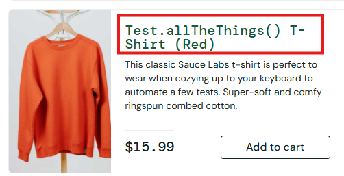

# 🐞 BR-002 - Product Name Not Properly Formatted

## Environment
- Browser: Chrome
- OS: Windows 11

## Steps to Reproduce
1. Login to application
2. Locate "Test.allTheThings() T-Shirt (Red)"

## Expected Result
Product name should appear clean and readable.

## Actual Result
Product name appears inconsistent and unclear.

## Severity
Low

## Priority
Low

## Status
New

## 📎 Attachment

