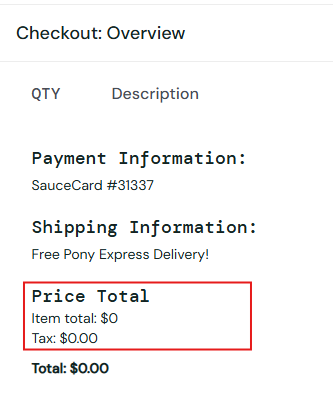

# 🐞 BR-003 - Checkout Allowed With Empty Cart

## Environment
- Browser: Chrome
- OS: Windows 11

## Steps to Reproduce
1. Login to application
2. Do not add any item
3. Navigate to cart
4. Click Checkout

## Expected Result
System should prevent checkout and display an appropriate message.

## Actual Result
User is able to proceed to checkout.

## Severity
High

## Priority
High

## Status
New

## 📎 Attachment
