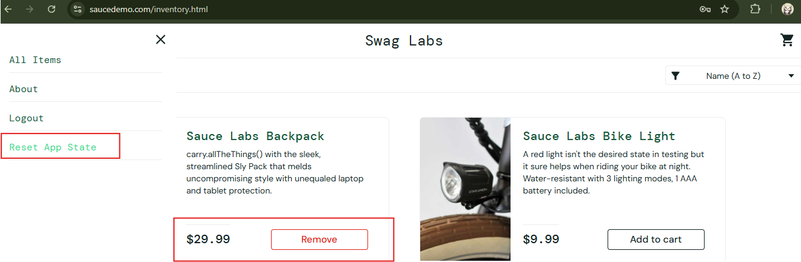

# 🐞 BR-004 - Reset App State clears cart but UI still shows "Remove" Button

## Environment
- Browser: Chrome
- OS: Windows 11

## Steps to Reproduce
1. Login
2. Add item on cart
3. Click Reset App State
4. Observe buttons

## Expected Result
Buttons should revert to "Add to Cart".

## Actual Result
Remove button still displayed.

## Severity
Medium

## Priority
Medium

## Status
New

## 📎 Attachment
