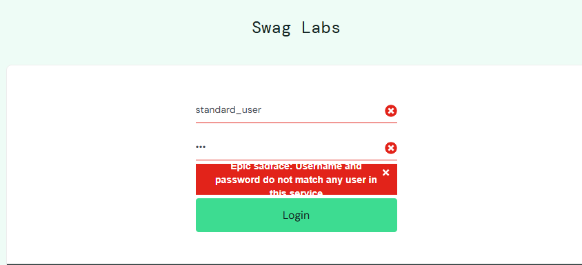
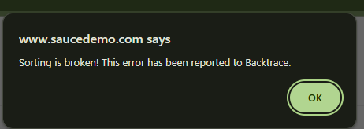
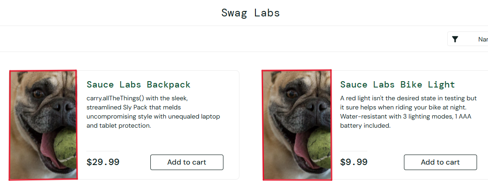
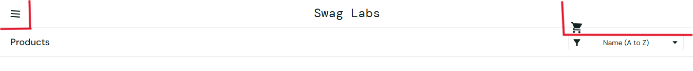
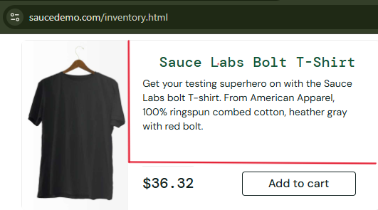
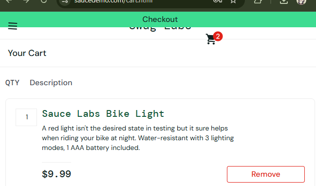
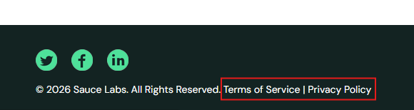

# Exploratory Testing — SauceDemo

## Session Overview

| Field | Details |
|---|---|
| **Tester** | Smrity Thapa |
| **Application** | SauceDemo (https://www.saucedemo.com) |
| **Environment** | Chrome · Windows 11 |
| **Login Used** | `standard_user` / `secret_sauce` |
| **Session Type** | Unscripted Exploratory Testing |
| **Areas Covered** | Login · Product Listing · Cart · Checkout · UI/Layout · Footer |

---

## Charter

> Explore the SauceDemo web application to identify functional defects, UI inconsistencies, and usability issues through unscripted testing — without following predefined test cases.

---

## Areas Explored

| # | Area | What Was Tested |
|---|---|---|
| 1 | **Login** | Valid/invalid credentials, error message specificity |
| 2 | **Product Listing** | Product names, descriptions, images, sorting functionality |
| 3 | **Cart** | Add/remove items, empty cart behavior, cart persistence |
| 4 | **Checkout Flow** | Full checkout, empty cart checkout, button placement |
| 5 | **App State** | Reset App State functionality and UI sync |
| 6 | **UI & Layout** | Header alignment, text alignment, product card layout |
| 7 | **Footer** | Footer links and navigation |

---

## Bugs Found

### BR-001 — Login Error Message Not Specific

| Field | Details |
|---|---|
| **Severity** | Low |
| **Priority** | Medium |
| **Status** | New |

**Steps to Reproduce:**
1. Open login page
2. Enter invalid credentials
3. Click Login

**Expected:** System should specify whether username or password is incorrect.  
**Actual:** A generic error message is displayed.

📎 

---

### BR-002 — Product Name Not Properly Formatted

| Field | Details |
|---|---|
| **Severity** | Low |
| **Priority** | Low |
| **Status** | New |

**Steps to Reproduce:**
1. Login to application
2. Locate "Test.allTheThings() T-Shirt (Red)"

**Expected:** Product name should appear clean and readable.  
**Actual:** Product name appears inconsistent and unclear.

📎 

---

### BR-003 — Checkout Allowed With Empty Cart 

| Field | Details |
|---|---|
| **Severity** | High |
| **Priority** | High |
| **Status** | New |

**Steps to Reproduce:**
1. Login to application
2. Do not add any item
3. Navigate to cart
4. Click Checkout

**Expected:** System should prevent checkout and display an appropriate warning message.  
**Actual:** User is able to proceed to checkout with an empty cart.

📎 

---

### BR-004 — Reset App State Clears Cart But UI Still Shows "Remove" Button

| Field | Details |
|---|---|
| **Severity** | Medium |
| **Priority** | Medium |
| **Status** | New |

**Steps to Reproduce:**
1. Login
2. Add item to cart
3. Click Reset App State from the burger menu
4. Observe product buttons

**Expected:** Buttons should revert to "Add to Cart" after reset.  
**Actual:** "Remove" button still displayed despite cart being cleared.

📎 

---

### BR-005 — Product Description Improperly Formatted

| Field | Details |
|---|---|
| **Severity** | Low |
| **Priority** | Low |
| **Status** | New |

**Steps to Reproduce:**
1. Login to application
2. Locate Sauce Labs Backpack
3. Observe description formatting

**Expected:** Description should be properly formatted and readable.  
**Actual:** Description appears inconsistent.

📎 

---

### BR-006 — Sorting Functionality Not Working

| Field | Details |
|---|---|
| **Severity** | Medium |
| **Priority** | Medium |
| **Status** | New |

**Steps to Reproduce:**
1. Login to application
2. Use sorting dropdown
3. Select any sorting option

**Expected:** Products should sort correctly based on selected option.  
**Actual:** Sorting does not work as expected.

📎 

---

### BR-007 — Product Image Does Not Match Description

| Field | Details |
|---|---|
| **Severity** | Medium |
| **Priority** | Medium |
| **Status** | New |

**Steps to Reproduce:**
1. Login to application
2. Observe product images and their details

**Expected:** Image should match the product name and description.  
**Actual:** Image does not correspond to displayed product details.

📎 

---

### BR-008 — Header UI Misalignment

| Field | Details |
|---|---|
| **Severity** | Low |
| **Priority** | Low |
| **Status** | New |

**Steps to Reproduce:**
1. Login to application
2. Observe header section

**Expected:** Menu and cart icons should be properly aligned.  
**Actual:** Icons appear slightly misaligned.

📎 

---

### BR-009 — Product Text Alignment Issue

| Field | Details |
|---|---|
| **Severity** | Low |
| **Priority** | Low |
| **Status** | New |

**Steps to Reproduce:**
1. Login to application
2. Observe product text alignment on listing page

**Expected:** Product name and description should align properly within cards.  
**Actual:** Misalignment observed between product name and description.

📎 

---

### BR-010 — Checkout Button Placement Issue

| Field | Details |
|---|---|
| **Severity** | Low |
| **Priority** | Medium |
| **Status** | New |

**Steps to Reproduce:**
1. Login
2. Add product to cart
3. Navigate to cart page
4. Observe checkout button position

**Expected:** Checkout button should be clearly positioned and accessible.  
**Actual:** Button placement appears inconsistent.

📎 

---

### BR-011 — Footer Links Not Clickable

| Field | Details |
|---|---|
| **Severity** | Medium |
| **Priority** | Medium |
| **Status** | New |

**Steps to Reproduce:**
1. Scroll to footer section
2. Click Terms of Service or Privacy Policy links

**Expected:** Links should open their respective pages.  
**Actual:** Links are not clickable.

📎 

---

## 📊 Session Metrics

| Metric | Value |
|---|---|
| **Total Bugs Found** | 11 |
| **High Severity** | 1 (BR-003) |
| **Medium Severity** | 4 (BR-004, BR-006, BR-007, BR-011) |
| **Low Severity** | 6 (BR-001, BR-002, BR-005, BR-008, BR-009, BR-010) |
| **Functional Bugs** | 4 |
| **UI/Layout Bugs** | 7 |

---

## 💡 Key Observations

- **Most critical finding:** BR-003 (empty cart checkout) is a significant functional gap that could affect real users and revenue in a production app.
- **UI issues are dominant:** 7 out of 11 bugs are UI/layout related, suggesting the `problem_user` profile was likely used which intentionally introduces visual defects.
- **State management issue:** BR-004 reveals a disconnect between backend state and UI rendering after reset — a common and important bug type to document.
- **Footer is completely broken:** BR-011 means legal/compliance links are inaccessible, which would be a compliance issue in a real application.

---

## What Worked Well

- Login validation is present (though message is generic)
- Cart persists across page navigation
- Full checkout flow completes successfully with items in cart
- Logout functionality works correctly

---

## 👨‍💻 Author
*Created as part of QA learning journey by Smrity Thapa*  
*Repository: https://github.com/Smrity-Thapa33/qa_fundamentals*